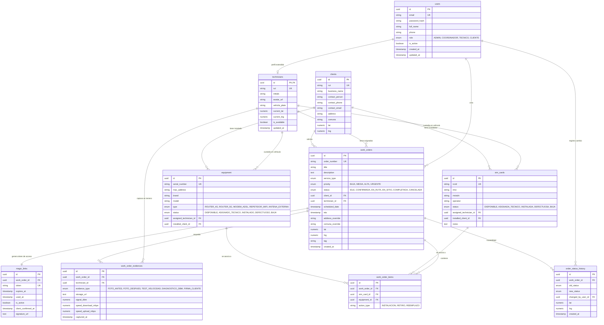

# 📊 Modelo Entidad-Relación (DER) - Proyecto Atlas FSM

**Autor:** Alexander Sáez López (Gestión y Modelado de Base de Datos)  
**Proyecto:** Atlas - Field Service Management (FSM) para Entel  
**Motor de Base de Datos:** PostgreSQL 15+ Serverless (Neon.tech / Supabase / AWS RDS)  
**Rama Git:** `base-datos`

---

## 1. Diagrama Entidad-Relación (Mermaid)

---

## 2. Descripción de Entidades y Normalización

1. **`users` y `technicians` (Especialización 1:1):**
   * Se desacopla la autenticación general de los datos específicos de campo del técnico (patente de vehículo, iniciales, última geolocalización GPS y estado de disponibilidad).
2. **`clients`:**
   * Almacena clientes corporativos (Entel HQ, BancoEstado) y pymes, incluyendo dirección y coordenadas para cálculo de rutas del Dispatch Board.
3. **`work_orders` (Núcleo FSM):**
   * Representa los tickets de servicio. Maneja los 6 estados estandarizados: `IDLE` (Pendiente), `CONFIRMADA` (Visita aprobada), `EN_RUTA` (Técnico viajando), `EN_SITIO` (En el lugar), `COMPLETADA` y `CANCELADA`.
4. **`magic_links`:**
   * Garantiza acceso sin fricción para el cliente final mediante tokens UUID criptográficamente seguros con tiempo de expiración y auditoría de firma digital.
5. **`sim_cards` y `equipment`:**
   * Inventario trazable con doble relación: una SIM o Router puede estar bajo custodia de un técnico (en la camioneta) o instalada formalmente en la sede de un cliente.
6. **`work_order_evidences`:**
   * Respaldo técnico de la App Móvil para auditar calidad de instalación (fotos, potencias dBm de señal 4G/5G y mediciones de ancho de banda).
7. **`order_status_history`:**
   * Trazabilidad inmutable que registra cada transición de estado con coordenadas del técnico, impidiendo manipulación de SLAs.
