# 🏛️ Arquitectura de Datos y Modelo Entidad-Relación (DER)

**Proyecto:** Atlas - Field Service Management (FSM) para Entel  
**Módulo:** Base de Datos Relacional  
**Autor:** Alexander Sáez López (Ingeniería en Informática - Duoc UC)  
**Motor:** PostgreSQL 15+ Serverless (Neon.tech / AWS US East 2)  
**Versión del Esquema:** 1.2.0  

---

## 1. Visión General y Objetivos de Diseño

La arquitectura de datos de **Atlas** fue concebida para soportar una plataforma de gestión de servicios en terreno de alta criticidad, donde intervienen simultáneamente tres actores:
1. **Coordinadores (Panel Web):** Requieren consultas analíticas rápidas de despacho, visualización de técnicos en mapas y control de inventario.
2. **Técnicos (Aplicación Móvil PWA):** Operan en terreno, frecuentemente en zonas con conectividad intermitente (subterráneos o áreas rurales), necesitando generar identificadores de forma local y reportar telemetría.
3. **Clientes (Portal de Autoservicio):** Acceden a través de enlaces seguros sin contraseña (**Magic Links**) para confirmar visitas y firmar conformidad digital.

### Principios Arquitectónicos Aplicados:
* **Normalización en Tercera Forma Normal (3FN):** Eliminación de redundancias y garantía de integridad referencial.
* **Uso de UUIDs (v4 / `gen_random_uuid()`):** 
  * **Seguridad:** Impide ataques de enumeración en URLs públicas (`/portal/cliente/uuid` en lugar de IDs correlativos predecibles).
  * **Soporte Offline:** Permite a la app móvil de los técnicos generar registros locales sin consultar secuencias al servidor central.
  * **Escalabilidad:** Cero colisiones en réplicas distribuidas.
* **Tipos Enumerados Nativos (`ENUM`):** Validación estricta a nivel de motor para estados, prioridades y roles, impidiendo la inserción de cadenas arbitrarias.
* **Auditoría e Inmutabilidad:** Trazabilidad completa de cambios de estado con coordenadas GPS del técnico.

---

## 2. Diagrama Entidad-Relación (Mermaid)

```mermaid
erDiagram
    users ||--o| technicians : "perfil operativo"
    users ||--o{ work_orders : "crea orden"
    users ||--o{ order_status_history : "registra transicion"

    technicians ||--o{ work_orders : "tiene asignadas"
    technicians ||--o{ sim_cards : "custodia en movil"
    technicians ||--o{ equipment : "custodia en movil"
    technicians ||--o{ work_order_evidences : "captura en terreno"

    clients ||--o{ work_orders : "solicita servicio"
    clients ||--o{ sim_cards : "tiene instaladas"
    clients ||--o{ equipment : "tiene instalado"

    work_orders ||--|| magic_links : "genera token"
    work_orders ||--o{ work_order_items : "asocia hardware"
    work_orders ||--o{ work_order_evidences : "respalda trabajo"
    work_orders ||--o{ order_status_history : "auditoria de estados"

    sim_cards ||--o{ work_order_items : "se asigna a"
    equipment ||--o{ work_order_items : "se asigna a"

    users {
        uuid id PK "gen_random_uuid()"
        varchar email UK "Email corporativo"
        varchar password_hash "Bcrypt hash"
        varchar full_name "Nombre completo"
        varchar phone "Telefono contacto"
        enum role "ADMIN, COORDINADOR, TECNICO, CLIENTE"
        boolean is_active "Estado usuario"
        timestamptz created_at
        timestamptz updated_at
    }

    technicians {
        uuid id PK, FK "Referencia a users(id)"
        varchar rut UK "RUT chileno validado"
        varchar initials "Iniciales avatar (ej. CM, JR)"
        text avatar_url "Foto perfil"
        varchar vehicle_plate "Patente camioneta"
        numeric current_lat "Ultima latitud GPS"
        numeric current_lng "Ultima longitud GPS"
        boolean is_available "Disponibilidad despacho"
        timestamptz updated_at
    }

    clients {
        uuid id PK "gen_random_uuid()"
        varchar rut UK "RUT empresa o persona"
        varchar business_name "Razon social o nombre"
        varchar contact_person "Contacto en sitio"
        varchar contact_phone "Telefono"
        varchar contact_email "Email para Magic Link"
        varchar address "Direccion fisica"
        varchar comuna "Comuna despacho"
        numeric lat "Latitud geocodificada"
        numeric lng "Longitud geocodificada"
    }

    work_orders {
        uuid id PK "gen_random_uuid()"
        varchar order_number UK "Identificador legible (ej. #OT-08491)"
        varchar title "Titulo del servicio"
        text description "Alcance tecnico"
        enum service_type "Tipo instalacion o soporte"
        enum priority "BAJA, MEDIA, ALTA, URGENTE"
        enum status "IDLE, CONFIRMADA, EN_RUTA, EN_SITIO, COMPLETADA, CANCELADA"
        uuid client_id FK "Cliente receptor"
        uuid technician_id FK "Tecnico asignado"
        timestamptz scheduled_date "Fecha compromiso"
        timestamptz eta "Hora estimada de llegada"
        varchar tag "Tag visual Kanban"
        timestamptz completed_at
    }

    magic_links {
        uuid id PK "gen_random_uuid()"
        uuid work_order_id FK "OT asociada"
        varchar token UK "Token hash seguro"
        timestamptz expires_at "Vencimiento (48h)"
        timestamptz used_at "Fecha consumo"
        boolean is_active "Estado token"
        timestamptz client_confirmed_at "Confirmacion visita"
        text signature_url "Firma digital conforme"
    }

    sim_cards {
        uuid id PK "gen_random_uuid()"
        varchar iccid UK "Codigo unico SIM (19-22 digitos)"
        varchar imsi "Identificador IMSI"
        varchar msisdn "Numero de linea"
        varchar operator "Entel"
        enum status "DISPONIBLE, ASIGNADA_TECNICO, INSTALADA, DEFECTUOSA, BAJA"
        uuid assigned_technician_id FK "Custodia tecnico"
        uuid installed_client_id FK "Instalada en cliente"
    }

    equipment {
        uuid id PK "gen_random_uuid()"
        varchar serial_number UK "Numero de serie unico"
        varchar mac_address "Direccion MAC hardware"
        varchar brand "Huawei, Teltonika, Mikrotik"
        varchar model "Modelo equipo"
        enum type "ROUTER_4G, ROUTER_5G, MODEM_ADSL, REPETIDOR_WIFI, ANTENA_EXTERNA"
        enum status "DISPONIBLE, ASIGNADO_TECNICO, INSTALADO, DEFECTUOSO, BAJA"
        uuid assigned_technician_id FK
        uuid installed_client_id FK
    }

    work_order_items {
        uuid id PK "gen_random_uuid()"
        uuid work_order_id FK
        uuid sim_card_id FK
        uuid equipment_id FK
        varchar action_type "INSTALACION, RETIRO, REEMPLAZO"
    }

    work_order_evidences {
        uuid id PK "gen_random_uuid()"
        uuid work_order_id FK
        uuid technician_id FK
        enum evidence_type "FOTO_ANTES, FOTO_DESPUES, TEST_VELOCIDAD, DIAGNOSTICO_DBM, FIRMA_CLIENTE"
        text storage_url "URL Google Cloud Storage"
        numeric signal_dbm "Nivel senal (-85 dBm)"
        numeric speed_download_mbps
        numeric speed_upload_mbps
        timestamptz captured_at
    }

    order_status_history {
        uuid id PK "gen_random_uuid()"
        uuid work_order_id FK
        enum old_status
        enum new_status
        uuid changed_by_user_id FK
        numeric lat "Geocerca de cambio"
        numeric lng "Geocerca de cambio"
        timestamptz created_at
    }
```

---

## 3. Diccionario de Datos Exhaustivo (Data Dictionary)

### 3.1 Tabla: `users`
Contiene las credenciales y perfiles base para todos los actores de la plataforma.

| Columna | Tipo de Dato | Modificadores | Descripción |
| :--- | :--- | :--- | :--- |
| `id` | `UUID` | `PRIMARY KEY`, Default: `gen_random_uuid()` | Identificador único universal del usuario. |
| `email` | `VARCHAR(255)` | `UNIQUE`, `NOT NULL` | Correo electrónico institucional o personal (login). |
| `password_hash` | `VARCHAR(255)` | `NOT NULL` | Hash de la contraseña con salt (Bcrypt / Argon2). |
| `full_name` | `VARCHAR(150)` | `NOT NULL` | Nombre y apellido del usuario. |
| `phone` | `VARCHAR(50)` | `NULL` | Teléfono móvil de contacto internacional (+569...). |
| `role` | `user_role_enum` | `NOT NULL`, Default: `'TECNICO'` | Rol en la plataforma: `ADMIN`, `COORDINADOR`, `TECNICO`, `CLIENTE`. |
| `is_active` | `BOOLEAN` | `NOT NULL`, Default: `TRUE` | Bandera de activación/bloqueo de cuenta. |
| `created_at` | `TIMESTAMPTZ` | Default: `CURRENT_TIMESTAMP` | Fecha y hora de registro en UTC. |
| `updated_at` | `TIMESTAMPTZ` | Auto-actualizable vía trigger | Fecha y hora de última modificación. |

### 3.2 Tabla: `technicians`
Especialización 1:1 de `users` para personal de operaciones en terreno.

| Columna | Tipo de Dato | Modificadores | Descripción |
| :--- | :--- | :--- | :--- |
| `id` | `UUID` | `PRIMARY KEY`, `FK -> users(id) ON DELETE CASCADE` | Llave foránea que hereda la identidad de `users`. |
| `rut` | `VARCHAR(20)` | `UNIQUE`, `NOT NULL` | Rol Único Tributario chileno con guión y dígito verificador. |
| `initials` | `VARCHAR(10)` | `NOT NULL` | Iniciales para avatares en Dispatch Board (ej. `CM`, `JR`). |
| `avatar_url` | `TEXT` | `NULL` | Enlace a imagen de perfil en bucket. |
| `vehicle_plate` | `VARCHAR(20)` | `NULL` | Patente del móvil de servicio asignado (ej. `KDXL-42`). |
| `current_lat` | `NUMERIC(10, 7)` | `NULL` | Latitud GPS reportada por la app móvil en tiempo real. |
| `current_lng` | `NUMERIC(10, 7)` | `NULL` | Longitud GPS reportada por la app móvil en tiempo real. |
| `is_available` | `BOOLEAN` | `NOT NULL`, Default: `TRUE` | Estado de disponibilidad para recibir nuevas órdenes. |

### 3.3 Tabla: `clients`
Registra a los clientes corporativos o particulares que reciben atención en terreno.

| Columna | Tipo de Dato | Modificadores | Descripción |
| :--- | :--- | :--- | :--- |
| `id` | `UUID` | `PRIMARY KEY`, Default: `gen_random_uuid()` | Identificador único del cliente. |
| `rut` | `VARCHAR(20)` | `UNIQUE`, `NULL` | RUT de la empresa o cliente titular. |
| `business_name` | `VARCHAR(200)` | `NOT NULL` | Razón social o nombre completo del cliente. |
| `contact_person` | `VARCHAR(150)` | `NULL` | Nombre de la persona de contacto en el domicilio/oficina. |
| `contact_phone` | `VARCHAR(50)` | `NOT NULL` | Teléfono para coordinación de llegada técnica. |
| `contact_email` | `VARCHAR(255)` | `NOT NULL` | Correo donde se despachan los Magic Links. |
| `address` | `VARCHAR(300)` | `NOT NULL` | Dirección completa (calle, número, piso/oficina). |
| `comuna` | `VARCHAR(100)` | `NOT NULL` | Comuna de la visita (usada para filtros geográficos). |
| `region` | `VARCHAR(100)` | Default: `'Metropolitana'` | Región administrativa. |
| `lat` | `NUMERIC(10, 7)` | `NULL` | Latitud para graficación en el mapa del Dispatch Board. |
| `lng` | `NUMERIC(10, 7)` | `NULL` | Longitud para graficación en el mapa del Dispatch Board. |

### 3.4 Tabla: `work_orders`
Entidad central de la plataforma FSM. Modela el ciclo de vida de los servicios técnicos.

| Columna | Tipo de Dato | Modificadores | Descripción |
| :--- | :--- | :--- | :--- |
| `id` | `UUID` | `PRIMARY KEY`, Default: `gen_random_uuid()` | Identificador interno. |
| `order_number` | `VARCHAR(50)` | `UNIQUE`, `NOT NULL` | Código human-readable visible para el usuario (ej. `#OT-08491`). |
| `title` | `VARCHAR(250)` | `NOT NULL` | Nombre descriptivo del trabajo (ej. "Instalación fibra óptica"). |
| `description` | `TEXT` | `NULL` | Instrucciones técnicas detalladas para la visita. |
| `service_type` | `service_type_enum` | `NOT NULL` | Tipo de servicio: `INSTALACION_FIBRA`, `CAMBIO_SIM`, etc. |
| `priority` | `order_priority_enum` | `NOT NULL`, Default: `'MEDIA'` | Severidad: `BAJA`, `MEDIA`, `ALTA`, `URGENTE`. |
| `status` | `order_status_enum` | `NOT NULL`, Default: `'IDLE'` | Estado: `IDLE`, `CONFIRMADA`, `EN_RUTA`, `EN_SITIO`, `COMPLETADA`, `CANCELADA`. |
| `client_id` | `UUID` | `NOT NULL`, `FK -> clients(id)` | Cliente al que se le realiza el trabajo. |
| `technician_id` | `UUID` | `NULL`, `FK -> technicians(id)` | Técnico responsable asignado para la ejecución. |
| `scheduled_date` | `TIMESTAMPTZ` | `NOT NULL` | Fecha y ventana horaria comprometida con el cliente. |
| `eta` | `TIMESTAMPTZ` | `NULL` | Estimación dinámica de hora de llegada en tiempo real. |
| `tag` | `VARCHAR(50)` | `NULL` | Etiqueta visual para Kanban (`Fibra`, `SIM`, `Red`, `Hardware`). |
| `completed_at` | `TIMESTAMPTZ` | `NULL` | Marca temporal exacta de finalización del servicio. |

### 3.5 Tabla: `magic_links`
Permite el seguimiento y firma sin contraseña desde el portal cliente.

| Columna | Tipo de Dato | Modificadores | Descripción |
| :--- | :--- | :--- | :--- |
| `id` | `UUID` | `PRIMARY KEY`, Default: `gen_random_uuid()` | Identificador del registro. |
| `work_order_id` | `UUID` | `NOT NULL`, `FK -> work_orders(id)` | Orden de trabajo a la que da acceso el enlace. |
| `token` | `VARCHAR(128)` | `UNIQUE`, `NOT NULL` | Token criptográfico aleatorio incluido en la URL. |
| `expires_at` | `TIMESTAMPTZ` | `NOT NULL` | Expiración por seguridad (generalmente 48 horas). |
| `used_at` | `TIMESTAMPTZ` | `NULL` | Timestamp de apertura del enlace. |
| `is_active` | `BOOLEAN` | `NOT NULL`, Default: `TRUE` | Permite invalidar el enlace si se reprograma la visita. |
| `client_confirmed_at`| `TIMESTAMPTZ`| `NULL` | Momento en que el cliente presionó "Confirmar Visita". |
| `signature_url` | `TEXT` | `NULL` | URL de la firma digital capturada en pantalla táctil. |

### 3.6 Tablas de Inventario: `sim_cards` y `equipment`
Garantizan la trazabilidad del hardware en stock, en ruta (camioneta del técnico) o instalado en cliente.

* **`sim_cards`:** Identifica tarjetas SIM por `iccid` (clave de 19-22 dígitos de Entel), `imsi`, `msisdn`, y su estado (`DISPONIBLE`, `ASIGNADA_TECNICO`, `INSTALADA`, `DEFECTUOSA`, `BAJA`).
* **`equipment`:** Identifica Routers 4G/5G, repetidores y antenas por `serial_number` y `mac_address`, registrando custodio actual y cliente final.

---

## 4. Índices de Rendimiento y Triggers

Para garantizar que el Dispatch Board y las APIs de FastAPI respondan en menos de **50 ms**:
* `idx_work_orders_status`: Acelera el filtrado por columnas del tablero Kanban.
* `idx_work_orders_technician`: Optimiza la carga de tareas asignadas en la app móvil.
* `idx_magic_links_token`: Búsqueda instantánea de tokens al abrir el portal de cliente.
* `idx_sim_cards_iccid` y `idx_equipment_serial`: Búsqueda por escaneo de código de barras / QR.
* `update_updated_at_column()`: Trigger PL/pgSQL que actualiza de forma transparente la marca temporal `updated_at` en cada operación `UPDATE`.
